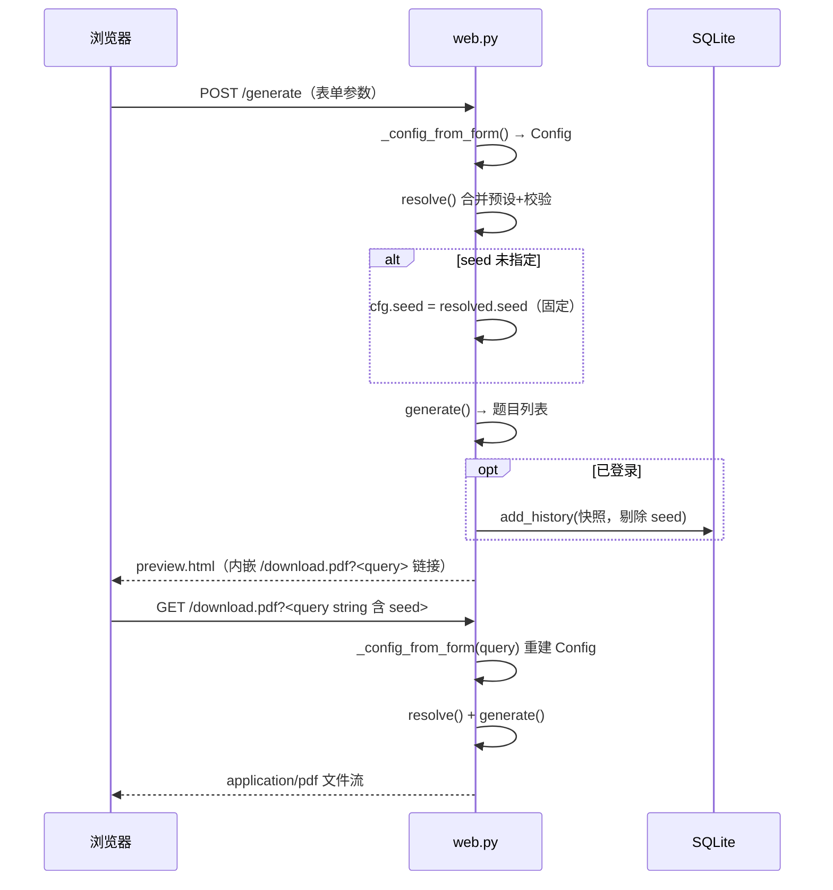

# API 参考

面向开发者的接口文档。说明网页路由、认证模型、配置 query-string 往返与错误模型。架构总览见 [architecture.md](architecture.md)，数据表结构见 [database.md](database.md)，面向用户的功能说明见 [user-guide.md](user-guide.md)。

## 基础信息

- Web 应用为 FastAPI（`src/mathgen/web.py`），标题 "Kids Math"；
- OpenAPI/Swagger 文档位于 **`/api/docs`**（FastAPI 自带交互界面）；
- 静态资源挂载于 **`/static`**（`StaticFiles`）；
- 模板为 Jinja2（`src/mathgen/templates/`）；
- 默认 Base URL：`http://127.0.0.1:8080`（`serve()` 默认 host `127.0.0.1`、port `8080`，见 `cli.py`/`web.main`）。

启动：

```bash
uv run mathgen-serve --host 0.0.0.0 --port 8080
```

## 认证模型

- 会话为 **cookie**：`COOKIE_NAME = "kidsmath_session"`（`auth.py`）。Cookie 属性：`httponly`、`samesite=lax`、HTTPS 下 `secure`、有效期 **30 天**（`SESSION_DAYS`）。
- 会话 token 由 `secrets.token_urlsafe(32)` 生成，**DB 只存 sha256 哈希**；登录时 `cleanup_sessions()` 清理过期会话。
- `UserAndCSRFMiddleware` 为每个请求设置 `request.state.user`：读 cookie → sha256 → DB `get_user_by_token_hash`。
- **CSRF/跨域防护**：对非 `GET/HEAD/OPTIONS` 请求，若带 `Origin` 头且其 hostname 与请求 hostname 不一致，返回 403 纯文本 `请求来源不合法`。
- 依赖注入 `current_user(request)`（`web.py`）：直接读 cookie 返回用户 dict 或 `None`，与中间件等价。
- **未登录行为分两种**：
  - HTML 路由 → `302` 重定向 `/login?next=<原路径>`；
  - JSON API（`/api/me`、`/api/user/prefs`、音频、设置备份、错题预览等）→ `401` JSON `{"error": "unauthorized"}`。
- 登录用户缺 `mathgen_lang` / `mathgen_theme` cookie 时，中间件会用 DB 偏好自动补写（跨设备跟随）。

## 配置 query-string 往返

所有出题参数以 **query-string** 为唯一序列化载体，页面间、下载链接、历史/保存/错题快照全部复用同一套：

- 解析：`_config_from_form(form: dict) -> Config`；
- 序列化：`_as_query(cfg: Config) -> dict`（**只输出非默认值**，URL 紧凑）；
- `/download.pdf` 与 `/download.zip` 是**纯 GET**：从 query-string 重建 `Config` → `resolve()` → `generate()`，无状态、可分享、可复现。

关键语义：

- `POST /generate` 若表单无 `seed`，会取 `resolve()` 生成的 seed 写回并放进下载链接，保证**预览与下载题目一致**；
- 下载链接**必须带 `seed`**，否则返回 `400`（`seed_missing`）；
- `/download.zip` 每份卷子 seed 为 `base_seed + i - 1`（`i` 从 1 起），且**每次复用同一 `ResolvedConfig`**；
- 历史/保存快照用 `_snapshot_json()`，**剔除 `seed`**（记录的是参数而非具体某次题目）；
- ⚠️ **修改 `Config` 字段时必须同步 `_as_query`、`_config_from_form`**（以及 CLI 的 `_cfg_from_ns`），否则表单、链接与快照会不同步。

## 错误模型

- `ConfigError`（`config.py`）与 `GenerationError`（`engine.py`）都带 `.code` + `.params`，`str()` 输出中文；网页层用 `i18n.error_text(code, params, lang)` 渲染英文。
- **表单类页面出错回显表单，不返回 500**（`/generate`、配置导入、保存等重新渲染 `form.html`）；
- `/download.*` 出错返回 **`text/plain` 400**（含缺 seed、参数非法、生成失败）；
- JSON API 未登录统一 `401`，资源不存在 `404`，变式不可用 `422`。



## 路由表

认证列说明：**公开** = 无需登录；**登录** = 需要登录，未登录 `302 /login`；**登录(JSON 401)** = 需要登录，未登录返回 JSON `401`。

### 1. 公共页与认证

| 方法 | 路径 | 行为 | 认证 |
|---|---|---|---|
| GET | `/` | 出题表单；`?embed=1` 时为工作台内嵌表单 | 公开 |
| GET | `/product` | 产品介绍页 | 公开 |
| GET | `/guide` | 使用指南页 | 公开 |
| GET | `/docs` | 站内文档页 | 公开 |
| GET | `/member` | 会员中心 | 公开 |
| GET | `/login` / `/register` | 登录 / 注册页 | 公开 |
| POST | `/api/register` | 注册（校验用户名 2-32 位、密码 ≥6 位）并写会话 cookie | 公开 |
| POST | `/api/login` | 密码校验（pbkdf2）并写会话 cookie；校验 `next` 白名单 | 公开 |
| POST | `/api/logout` | 删除会话并清 cookie | 公开 |
| GET | `/api/me` | 返回 `{"username": ...}` | 登录(JSON 401) |
| POST | `/generate` | 表单 → 生成预览；登录时自动记历史 | 公开 |
| POST | `/api/config/export` | 导出单次出题参数 JSON（`{"version":1,"config":{...}}`） | 公开 |
| POST | `/api/config/import` | 导入上述 JSON 并重定向到表单 | 公开 |
| GET | `/healthz` | 健康检查 `{"status":"ok"}` | 公开 |
| GET | `/api/docs` | OpenAPI/Swagger | 公开 |

### 2. 用户配置 / 历史 / 保存

| 方法 | 路径 | 行为 | 认证 |
|---|---|---|---|
| GET | `/user` | 概览：生成数、错题统计、番茄统计、偏好 | 登录 |
| GET | `/user/history` | 历史配置列表（上限 200） | 登录 |
| GET | `/user/history/{hid}` | 历史详情：重放出题 + 题目列表 | 登录 |
| GET | `/user/saved` | 保存的配置列表 | 登录 |
| POST | `/api/history/{hid}/regenerate` | 历史配置回填出题表单 | 登录 |
| POST | `/api/history/{hid}/delete` | 删除该条历史 | 登录 |
| POST | `/api/history/{hid}/mistakes` | 把该次题目批量加入错题本（`kind=sheet`） | 登录 |
| POST | `/api/saved` | 保存当前配置（缺名默认「未命名」） | 登录 |
| POST | `/api/saved/{sid}/apply` | 应用保存的配置（回填表单） | 登录 |
| POST | `/api/saved/{sid}/rename` | 重命名 | 登录 |
| POST | `/api/saved/{sid}/delete` | 删除 | 登录 |

### 3. 账户 / 偏好 / 音频 / 备份

| 方法 | 路径 | 行为 | 认证 |
|---|---|---|---|
| POST | `/api/user/password` | 修改密码（校验旧密码、新密码 ≥6 位） | 登录 |
| POST | `/api/user/delete` | 删除账号及全部数据/文件，清 cookie | 登录 |
| POST | `/api/user/prefs` | 写主题/语言偏好，返回 `{"ok":true}` | 登录(JSON 401) |
| POST | `/api/audio/upload` | 上传音乐（白名单扩展名，≤20MB） | 登录(JSON 401) |
| GET | `/api/audio/list` | 音频列表 `[{id,name}]` | 登录(JSON 401) |
| GET | `/api/audio/{aid}` | 音频文件流 | 登录(JSON 401) |
| POST | `/api/audio/{aid}/delete` | 删除音频 | 登录(JSON 401) |
| GET | `/api/settings/export` | 全量备份 zip（`settings.json` + 音频文件，≤100MB 导入限） | 登录(JSON 401) |
| POST | `/api/settings/import` | 校验后清空并恢复备份（含音频） | 登录 |

### 4. 会员 / 错题 / 复习

| 方法 | 路径 | 行为 | 认证 |
|---|---|---|---|
| GET | `/member/errors` | 错题本（`?f=all/due/mastered` 过滤） | 登录 |
| GET | `/member/review` | SM-2 复习单卡队列（到期题 + 全部卡状态） | 登录 |
| GET | `/member/worksheet` | 在线答题卷；带 seed/topic/count 参数时渲染或先落 seed 再跳转 | 登录 |
| GET | `/member/timer` | 计时器（倒计时/正计时） | 公开 |
| GET | `/member/pomodoro` | 番茄钟页面；登录时显示统计/月历 | 公开 |
| POST | `/api/mistakes` | 从卷子加入错题（`kind=sheet`） | 登录 |
| POST | `/api/mistakes/manual` | 手动录入错题（`kind=manual`；在线答题交卷也走此接口） | 登录 |
| POST | `/api/mistakes/{mid}/mastered` | 标记已掌握 / 取消 | 登录 |
| POST | `/api/mistakes/{mid}/delete` | 删除错题 | 登录 |
| POST | `/api/mistakes/{mid}/note` | 更新笔记 | 登录 |
| POST | `/api/mistakes/{mid}/review` | SM-2 自评，`q ∈ {1,3,5}`（query 或表单），返回 `{"ok":true}` | 登录 |
| POST | `/api/mistakes/{mid}/reschedule` | 改期（只改 `due_at`，格式 `YYYY-MM-DD`，并取消已掌握） | 登录 |
| GET | `/api/mistakes/{mid}/preview` | 原题/变式预览 JSON（`?mode=original/variant`） | 登录(JSON 401) |
| POST | `/api/mistakes/{mid}/export` | 单题导出 PDF（`mode` 原题/变式） | 登录 |
| POST | `/api/mistakes/export-batch` | 批量导出 PDF（ids 逗号分隔或复选框，≤100 题） | 登录 |
| POST | `/api/pomodoro/log` | 记录番茄会话（`kind` focus/break + `sec`） | 登录 |
| POST | `/api/pomodoro/goal` | 设置每日目标 | 登录 |

### 5. AI 例题解析（本地正则，非 LLM）

`src/mathgen/parser.py` 的 `parse_examples()` 用零依赖正则从粘贴文本推断配置，全程本地处理。

| 方法 | 路径 | 行为 | 认证 |
|---|---|---|---|
| GET | `/member/ai` | AI 解析页 | 公开 |
| POST | `/api/ai/parse` | 解析例题文本，回显推断字段与识别率 | 公开 |
| POST | `/api/ai/backfill` | 用推断字段回填出题表单（剔除 seed） | 公开 |

### 6. 下载

| 方法 | 路径 | 行为 | 认证 |
|---|---|---|---|
| GET | `/download.pdf` | 无状态重建配置 → PDF 流；**缺 `seed` 返回 400** | 公开 |
| GET | `/download.zip` | 多份卷子（`sheets`）打包 zip；**缺 `seed` 返回 400** | 公开 |
