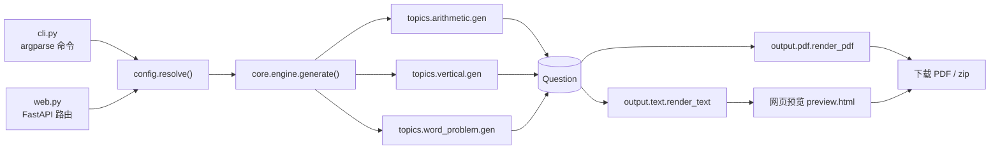

# 架构

## 系统概览

kidsmath（Kids Math）是小学数学练习题生成工具：CLI 与 FastAPI 网页双入口，按年级与参数随机出 1-6 年级题（口算 / 竖式 / 应用题），输出可打印 A4 PDF + 答案页。**纯规则生成，无 LLM**。另有用户系统、错题本（SM-2 复习）、番茄钟等会员页。

数据流：`参数（CLI / 表单 / 配置文件）→ config.resolve() → core.engine.generate() → output 渲染 → 下载`。

## 模块表

| 模块 | 用途 |
| --- | --- |
| config.py | `Config` / `ResolvedConfig` 参数模型、年级预设 `PRESETS`、`resolve()` 集中校验 |
| cli.py | argparse 命令行入口（`generate` / `serve` 子命令，支持 TOML 配置） |
| web.py | FastAPI 网页入口：表单、预览、PDF/zip 下载、会员页与 API |
| db.py | SQLite 数据层（模块单例连接 + `RLock`），见 [database.md](database.md) |
| auth.py | pbkdf2 密码哈希 + 会话 token（DB 存 sha256） |
| sm2.py | 简化 SM-2 间隔重复（q ∈ {1,3,5}），错题复习用 |
| parser.py | 例题文本 → 出题配置推断（零依赖正则规则引擎） |
| i18n.py | `UI_ZH` / `UI_EN` 字典、`t(key, lang)` 渲染、`error_text()` 错误文案 |
| core/question.py | `Question` 数据类（topic / statement / answer / expression / layout / steps） |
| core/engine.py | `generate()` 主流程、`_signature` 去重、进位借位与范围约束 |
| topics/arithmetic.py | 口算 / 四则混合题（含括号、运算符权重） |
| topics/vertical.py | 竖式题（`layout` 供 PDF 精确绘制） |
| topics/word_problem.py | 应用题（生活场景模板池，中英各 10 条） |
| topics/steps.py | 已生成答案的分步解题步骤（纯函数，无随机） |
| output/text.py | `arrange()` 分栏 / 编号方向布局（PDF 与网页预览共用）+ 纯文本渲染 |
| output/pdf.py | reportlab A4 卷子渲染：标题 / 页眉 / 答题线 / 答案页 / 竖式 |
| output/answer.py | 答案页行（`expression = answer`） |
| output/fonts.py | 中文字体回退链：包内 Noto 子集 → 系统字体 → CID 兜底 |
| `__init__.py` | `__version__ = "0.1.0"` |

## 配置模型（config.py）

- `Config` dataclass：用户输入，全部字段有默认值，`None` = 未显式指定。
- `ResolvedConfig`：合并年级预设 + 题型默认 + 显式参数后的具体配置，无可选值（仅 `carry`/`borrow` 可 `None`）。
- 三级优先级：**年级预设 `PRESETS` < 配置文件 / TOML < 显式参数**。
- `resolve(Config) -> ResolvedConfig`：集中校验，出错抛 `ConfigError(code, **params)`。
- 关键校验：`count` 1-500、`sheets` 1-100、`columns` ∈ {1,2,3}、`operand_count` 2-4、`paren_weight` 1-10、`number_direction` ∈ {row, column}、`lang` ∈ {zh, en} 等。
- 运算符归一：汉字「加减乘除」→ `+-×÷`（`normalize_operators`），去重且保持顺序。
- 题型默认（`TOPIC_DEFAULTS`）：`gap` 题间距与 `answer_lines` 每题答题横线数——arithmetic (16, 0)、vertical (20, 0)、word_problem (28, 2)。

### 年级预设要点

| 年级 | 要点 |
| --- | --- |
| 1 | 加减、0-9、无进位借位 |
| 2 | 加减乘、1-99、进位借位开 |
| 3 | 四则、100-999、除数 2-9 |
| 4 | 四则、1000-9999 |
| 5 | 3 运算数、括号、混合运算 |
| 6 | 4 运算数、括号、更大范围 |

## 出题引擎（core/engine.py）

- `generate(ResolvedConfig) -> list[Question]`：按 `cfg.topic` 分派到 `topics/*.gen(cfg, rng)`。
- seed 复现：全部随机只走引擎传入的 `rng = random.Random(cfg.seed)`；`seed=None` 时 `resolve()` 用 `random_seed()` 补一个（`secrets.randbelow(2**31)`）。
- 去重 `_signature(q)`：取 `expression` 规范化 token——× 交换律归一（操作数排序）、+−÷ 保持顺序、括号单独标记（避免 `"(1+2)×3"` 与 `"1+2×3"` 误判同题）。`dedupe=True` 时签名重复则重出。
- 重试守护：每份卷子重试上限 `count * 200`，超限抛 `GenerationError("dedupe_exhausted")`。
- 约束生成：`gen_result`（至多 1000 次候选直到结果落 `result_range`）、`gen_pair`（进位 / 借位逐列判定）、`check_result`（范围 + 非负）。
- ×÷ 范围推导：`left_factor_range` / `right_factor_range` / `divisor_range` / `quotient_range` / `dividend_bounds`，优先级为显式范围 > 显式乘法表 > 显式 operand_ranges > 预设表（详见 engine.py 注释）。

## Question 结构

| 字段 | 含义 |
| --- | --- |
| topic | 题型（arithmetic / vertical / word_problem） |
| statement | 题面文本（竖式为文本块，含换行） |
| answer | 答案字符串 |
| expression | 规范化算式（去重签名与答案页用） |
| layout | dict（竖式 `{"kind": "vertical", ...}`），供 PDF 精确绘制 |
| steps | 解题步骤列表（答案页与在线做题） |

## Web 层（web.py）

- FastAPI + Jinja2，无前端框架；`/static` 挂载静态资源，OpenAPI 在 `/api/docs`。
- `UserAndCSRFMiddleware`：
  - 会话 cookie（`kidsmath_session`）→ sha256 → DB 查用户 → `request.state.user`；
  - 非 GET / HEAD / OPTIONS 请求校验 Origin 同源，非法返回 403；
  - 302 重定向自动追加 `embed=1`（embed 模式内部跳转不丢参数）；
  - 登录用户缺 `mathgen_lang` / `mathgen_theme` cookie 时用 DB 偏好补齐（跨设备跟随）。
- **配置以 query-string 往返**：`_config_from_form()` 表单 / JSON → `Config`，`_as_query(Config)` 序列化回 query string。历史、保存、错题 params、配置导入导出全部复用这套快照；改 `Config` 字段时必须同步维护这两个函数。
- `/download.pdf`、`/download.zip` 纯 GET：从 query string 重建配置再生成，无状态、可分享链接；出错返回纯文本 400。
- zip 多份卷子：`seed = (cfg.seed or 0) + i - 1` 逐份生成。
- 登录用户 `/generate` 自动写 `config_history`（`_snapshot_json` 去掉 `seed`）。
- 顶栏导航与会员页；登录态用于历史 / 保存 / 错题 / 番茄 / 音乐等个性化功能。

### 工作台 SPA

- `index.html` 是壳：侧边栏 + `<iframe id="stage">`；页面以 `?embed=1` 加载，embed 模式隐藏导航。
- 切侧边栏 = 改 `stage.src`，无刷新；路由走 `location.hash`。
- `embed=1` 由中间件 + 页面 `injectEmbed()` 传播到所有内部链接 / 表单。
- `?app=1`（`_app_mode`）标记安卓 TWA 外壳模式。

## 错误模型

- `ConfigError`（config.py）与 `GenerationError`（engine.py）都带 `.code` + `.params`，`str()` 输出中文（`error_text(code, params, "zh")`）。
- 网页层用 `i18n.error_text(code, params, lang)` 渲染英文。
- 页面错误回显表单不 500；`/download.*` 出错返回纯文本 400。

## i18n 与主题（双通道）

- 服务端：`i18n.py` 的 `UI_ZH` / `UI_EN` 字典 + `t(key, lang)` 渲染模板；`UI = {"zh": UI_ZH, "en": UI_EN}` 序列化给前端。
- 客户端：`static/lang.js` 处理 `[data-i18n]` 属性动态切换，派发 `langchange` / `themechange` 事件；工作台 shell 收到事件后重载 iframe。
- 语言 / 主题存 cookie（`mathgen_lang` / `mathgen_theme`）；登录用户偏好落 `user_settings` 表，跨设备跟随。
- 新文案必须同时进两语言字典。

## 存储

- SQLite 单例连接，表结构与备份见 [database.md](database.md)。
- 登录用户上传音乐存 `<DB 父目录>/user_audio/<uid>/`，DB 的 `user_audio` 表记录路径。

## 相关文档

- [database.md](database.md) — SQLite 数据层与备份
- [api.md](api.md) — HTTP 路由与 API 契约
- [development.md](development.md) — 开发环境、测试约定、新增题型
- [deployment.md](deployment.md) — 部署与备份恢复
- [troubleshooting.md](troubleshooting.md) — 常见问题
- [contributing.md](contributing.md) — 提交规范
- [android.md](android.md) — 安卓 TWA 打包
- [superpowers/specs/](superpowers/specs/) — 设计规格归档；[superpowers/plans/](superpowers/plans/) — 实现计划归档
