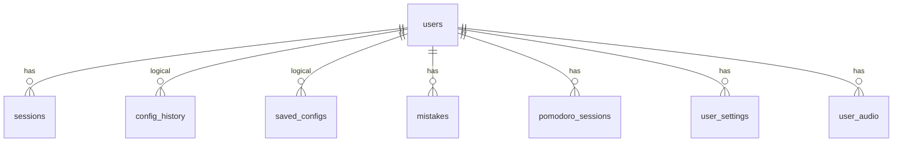

# 数据库

数据层为 SQLite 单文件，存储用户、会话、配置历史、保存配置、错题本、番茄记录、偏好设置与音频索引。实现集中在 [src/mathgen/db.py](../src/mathgen/db.py)（连接与 CRUD）与 [src/mathgen/auth.py](../src/mathgen/auth.py)（密码哈希 / 会话 token）。

## 连接行为（db.py）

| 行为 | 说明 |
| --- | --- |
| 单例连接 | 全局 `_conn`，`get_conn()` 首次调用懒创建，进程内复用 |
| 跨线程 | `sqlite3.connect(..., check_same_thread=False)`，配合 `threading.RLock()` 保护连接与路径 |
| 行工厂 | `row_factory = sqlite3.Row` |
| 写锁等待 | `PRAGMA busy_timeout=5000`（5 秒） |
| 不用 WAL | 源码注释：drvfs / 网络盘上 WAL 共享内存会挂起，故保持默认 journal 模式 |
| 幂等建表 | 每次 `get_conn()` 执行 `CREATE TABLE / INDEX IF NOT EXISTS`（`_init_tables`） |
| 测试隔离 | `configure(path)` 关闭旧连接并按新路径重建；`configure(None)` 重置。conftest 每测试配独立临时 DB |

## 路径解析优先级

```text
KIDSMATH_DB 环境变量 > configure(path) > 默认 data/kidsmath.db
```

- `_resolve_path()` 取第一个非空值，并 `Path(p).parent.mkdir(parents=True, exist_ok=True)` 自动创建父目录。
- 默认路径 `data/kidsmath.db` 相对进程 cwd；Docker 中由 compose 设为 `/data/kidsmath.db`。

## ER 图



DDL 中仅 `sessions` / `mistakes` / `pomodoro_sessions` / `user_settings` / `user_audio` 声明了 `REFERENCES users(id)` 外键；`config_history` 与 `saved_configs` 通过 `user_id` 逻辑归属，无 FK 约束。

## 表结构（按 `_init_tables` 实际列）

### users

| 列 | 类型 | 约束 |
| --- | --- | --- |
| id | INTEGER | PRIMARY KEY AUTOINCREMENT |
| username | TEXT | UNIQUE NOT NULL |
| password_hash | TEXT | NOT NULL |
| created_at | TEXT | NOT NULL |

密码哈希格式：`pbkdf2_sha256$200000$<salt hex>$<digest hex>`（auth.py，salt 16 字节）。

### sessions

| 列 | 类型 | 约束 |
| --- | --- | --- |
| token_hash | TEXT | PRIMARY KEY（会话 token 的 sha256） |
| user_id | INTEGER | NOT NULL REFERENCES users(id) |
| expires_at | TEXT | NOT NULL |

`expires_at > now` 才视为有效（`get_user_by_token_hash`）；登录时清理过期会话。

### config_history

| 列 | 类型 | 约束 |
| --- | --- | --- |
| id | INTEGER | PRIMARY KEY AUTOINCREMENT |
| user_id | INTEGER | NOT NULL |
| config_json | TEXT | NOT NULL |
| created_at | TEXT | NOT NULL |

### saved_configs

| 列 | 类型 | 约束 |
| --- | --- | --- |
| id | INTEGER | PRIMARY KEY AUTOINCREMENT |
| user_id | INTEGER | NOT NULL |
| name | TEXT | NOT NULL |
| config_json | TEXT | NOT NULL |
| created_at | TEXT | NOT NULL |

### mistakes（错题本，SM-2 复习）

| 列 | 类型 | 约束 |
| --- | --- | --- |
| id | INTEGER | PRIMARY KEY AUTOINCREMENT |
| user_id | INTEGER | NOT NULL REFERENCES users(id) |
| kind | TEXT | NOT NULL（`sheet` 卷子采集 / `manual` 手动录入） |
| topic | TEXT | NOT NULL |
| problem | TEXT | NOT NULL |
| answer | TEXT | NOT NULL |
| expression | TEXT | 可空 |
| question_json | TEXT | 可空（原题快照，重出 original 用） |
| params | TEXT | 可空（配置快照，重出 variant 用） |
| q_index | INTEGER | 可空（原卷题号） |
| note | TEXT | 可空 |
| wrong_at | TEXT | NOT NULL |
| ease | REAL | NOT NULL DEFAULT 2.5 |
| interval | INTEGER | NOT NULL DEFAULT 0 |
| reps | INTEGER | NOT NULL DEFAULT 0 |
| due_at | TEXT | NOT NULL |
| last_q | INTEGER | 可空（上次自评 q ∈ {1,3,5}） |
| mastered_at | TEXT | 可空（非空 = 已掌握） |

### pomodoro_sessions

| 列 | 类型 | 约束 |
| --- | --- | --- |
| id | INTEGER | PRIMARY KEY AUTOINCREMENT |
| user_id | INTEGER | NOT NULL REFERENCES users(id) |
| kind | TEXT | NOT NULL（`focus` / `break`） |
| planned_sec | INTEGER | NOT NULL |
| completed_at | TEXT | NOT NULL |

### user_settings

| 列 | 类型 | 约束 |
| --- | --- | --- |
| user_id | INTEGER | NOT NULL REFERENCES users(id) |
| key | TEXT | NOT NULL |
| value | TEXT | NOT NULL |

主键 `(user_id, key)`。key 示例：`lang`、`theme`、`pomodoro_goal`。

### user_audio

| 列 | 类型 | 约束 |
| --- | --- | --- |
| id | INTEGER | PRIMARY KEY AUTOINCREMENT |
| user_id | INTEGER | NOT NULL REFERENCES users(id) |
| name | TEXT | NOT NULL |
| path | TEXT | NOT NULL（实际音频文件绝对路径） |
| created_at | TEXT | NOT NULL |

## 索引

| 索引 | 表 | 列 | 用途 |
| --- | --- | --- | --- |
| idx_history_user | config_history | (user_id, created_at DESC) | 历史列表倒序 |
| idx_saved_user | saved_configs | (user_id) | 保存配置列表 |
| idx_mistakes_queue | mistakes | (user_id, due_at) | 到期复习队列 |
| idx_pomodoro_user | pomodoro_sessions | (user_id, completed_at) | 番茄统计 / 日历 |
| idx_user_audio_user | user_audio | (user_id) | 音频列表 |

## 常量

| 常量 | 值 | 说明 |
| --- | --- | --- |
| HISTORY_CAP | 200 | 每用户 `config_history` 保留最近 200 条（`add_history` 写入后 DELETE 超额行） |
| SESSION_DAYS | 30 | 会话有效期天数；db.py 与 auth.py 各定义一份（值同为 30） |
| DEFAULT_DB | data/kidsmath.db | 默认 DB 路径 |

## 音频存储

- `user_audio_dir(uid) = <DB 父目录>/user_audio/<uid>`。
- web 层上传（`/api/audio/upload`）与整体导入（`/api/settings/import`）时 `mkdir(parents=True, exist_ok=True)` 创建。
- 文件以 `uuid4().hex + 扩展名` 落盘；扩展名白名单：mp3 / wav / ogg / m4a / flac / aac / opus，单文件上限 20MB。
- 删除用户 / 清空数据时 db 层返回待删除文件路径列表，由 web 层 `os.unlink`。
- 用户整体备份 zip（`/api/settings/export`）内含 `settings.json`（version 2）与 `audio/<name>` 文件；导入先完整校验再清空恢复，坏行在清空前拒绝。

## 备份

- 完整数据 = DB 文件 + `<DB 父目录>/user_audio/`。
- Docker：compose 把命名卷 `mathgen-data` 挂到 `/data`（`KIDSMATH_DB=/data/kidsmath.db`），备份该卷即备份全部（含音频）。
- 用户也可在网页「用户信息」页导出 zip 整体备份（含错题、番茄记录、音乐歌单），导入即覆盖还原。
- 完整备份 / 恢复步骤见 [deployment.md](deployment.md)。
