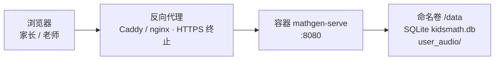

# 部署



## 局域网分享（老师/家长）

```bash
mathgen serve --host 0.0.0.0 --port 8080
```
同一 Wi-Fi 下用 `http://<本机IP>:8080` 访问。

## 公网（简单方式）

任意有公网 IP 或内网穿透的服务器：

```bash
pip install mathgen
nohup mathgen serve --host 0.0.0.0 --port 8080 &
```
建议反向代理加 HTTPS（如 caddy：`caddy reverse-proxy --from 你的域名 --to localhost:8080`）。

## Docker

镜像已内置中文字体（Noto Sans SC 子集）与模板/静态文件，无需额外下载，开箱即用。

### 构建并启动（docker compose）

```bash
docker compose up -d --build
```

访问 `http://<服务器IP>:8080`。健康检查自动执行（`/healthz`），重启策略 `unless-stopped`。

Compose 将 `KIDSMATH_DB` 设为 `/data/kidsmath.db`，并将命名卷 `mathgen-data` 挂载到 `/data`。该卷同时保存 SQLite 数据库和上传的用户音频目录 `/data/user_audio/<uid>`。`compose.yaml` 通过 `TZ: Asia/Shanghai` 声明容器时区；镜像基于 `python:3.12-slim-bookworm`，Dockerfile 已安装 `tzdata`，`TZ` 开箱即用。需要其他时区时，修改 `TZ` 为所需 IANA 时区后重新创建容器。

### 只用 Dockerfile

```bash
docker build -t mathgen:0.2.0 -t mathgen:latest .
# 数据卷必须手动挂载：/data/kidsmath.db（含用户/历史/保存配置）
docker run -d --name mathgen -p 8080:8080 --restart unless-stopped \
  -v mathgen-data:/data -e KIDSMATH_DB=/data/kidsmath.db -e TZ=Asia/Shanghai mathgen
```

### 备份与恢复数据卷

以下命令通过 Compose 使用当前项目的命名卷。为得到一致的 SQLite 备份，先停止服务；备份文件写入当前目录。恢复命令只解压并覆盖备份内同名文件，不会删除卷中其他数据。

镜像默认以非 root 的 `mathgen` 用户运行，无法保证可写宿主机当前目录；归档容器用 `--user root` 运行。生成的 tar 在宿主机上归 root 所有（属预期备份产物）。

```bash
# 备份完整 /data（含 kidsmath.db 和 user_audio/<uid>）
docker compose stop mathgen
docker compose run --rm --no-deps --user root -v "$PWD:/backup" --entrypoint sh mathgen \
  -c 'tar czf /backup/mathgen-data-$(date +%F).tar.gz -C /data .'
docker compose start mathgen

# 从完整备份恢复；将文件名替换为实际备份
docker compose stop mathgen
docker compose run --rm --no-deps --user root -v "$PWD:/backup" --entrypoint sh mathgen \
  -c 'tar xzf /backup/mathgen-data-YYYY-MM-DD.tar.gz -C /data'
docker compose start mathgen
```

### 常用操作

```bash
docker compose logs -f mathgen   # 看日志
docker compose restart mathgen   # 重启
docker compose down              # 停止（容器删除，数据保留在 mathgen-data 卷）
```

## PWA 安装

- 浏览器「安装应用」仅在 **https** 或 **localhost** 下可用；局域网用 `http://<IP>:8080` 访问时不显示安装入口，属浏览器限制，功能不受影响。
- nginx/caddy 反代时确认静态资源响应头：
  - `Content-Type: application/manifest+json` 用于 `/static/manifest.webmanifest`（缺失时部分浏览器仍可解析，但建议配全）；
  - `Cache-Control: no-cache` 或短 TTL 用于 `/static/sw.js`，避免旧 SW 长期驻留；
  - 其余静态资源（HTML/CSS/JS）建议 `Cache-Control: max-age=31536000, immutable` + SW 内部版本化刷新。
- Service Worker 预缓存并按缓存优先策略处理 `/`、`/product`、`/guide`、`/docs` 与 `/static/` 下的资源。除此白名单之外的请求均走网络，包括 `/user/*`、`/member/*`、`/login`、`/api/*`、`/generate` 与 `/download.*`。

## 说明

- 用户系统：账号密码登录（pbkdf2 哈希）、会话 cookie、历史与保存配置存 SQLite（`KIDSMATH_DB` 环境变量指定路径，默认 `data/kidsmath.db`）。
- 局域网/裸 HTTP 部署时自动禁用 Secure cookie（HTTPS 下启用）。
- 番茄钟/计时提示音：浏览器自动播放策略要求**首次点击**（开始按钮）后才可发声；后台标签页 JS 定时器被节流，提示音可能延迟到回前台才响，页面标题闪动为兜底。
- Service worker 版本 bump 后旧缓存自动清理（install 阶段），新版本部署后用户首次访问仍可能命中旧缓存页（显示旧 UI），刷新一次或等下一轮 install 即可。
- 预览与下载共用 seed，保证题目一致。
- Docker 镜像运行非 root 用户（mathgen），多阶段构建（uv 锁版本，`--no-dev` 不带测试依赖）。

## 相关文档

- [../README.md](../README.md) — 项目总览与快速上手
- [android.md](android.md) — 安卓 TWA 打包（依赖 HTTPS 部署）
- [database.md](database.md) — 数据层表结构与备份策略
- [troubleshooting.md](troubleshooting.md) — 常见问题排查
